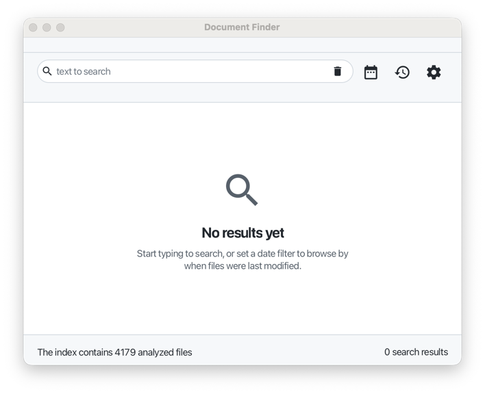
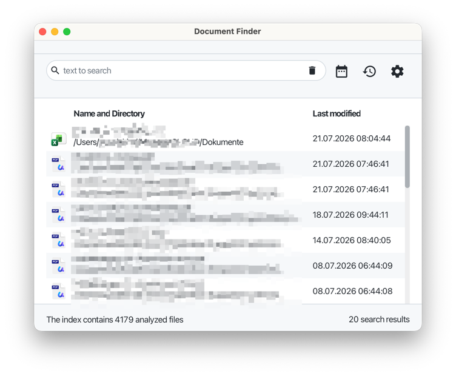
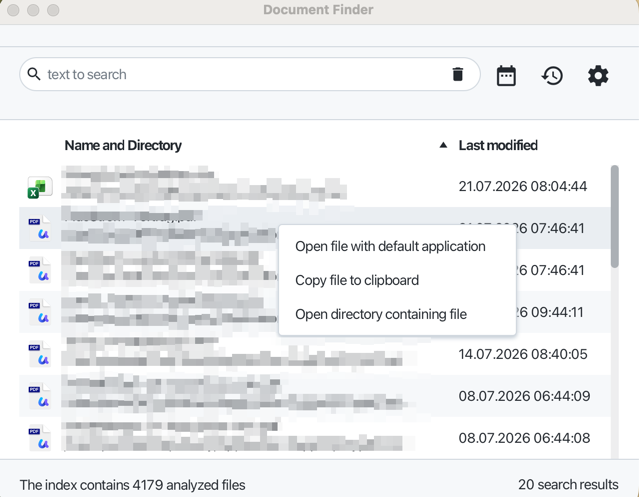

# document-finder

Document Finder is a desktop application for macOS, Windows and Linux that lets you find local
files quickly by full-text search. It indexes the content of the folders you configure and lets
you search across file names and file contents from a single search box.

|                        No search yet                        |                      Last 20 modified files                       |                     Context menu on a result                      |
|:-------------------------------------------------------------:|:-------------------------------------------------------------------:|:-------------------------------------------------------------------:|
|  |  |  |

## Features

- **Full-text search** across file names and file contents, powered by Apache Lucene for indexing
  and searching, and Apache Tika for content extraction.
- **Broad file type support**, including PDF, modern and legacy Microsoft Office documents, Apple
  iWork formats and plain text files.
- **Date filtering** — narrow results to files last modified within a preset range (today, last 7
  days, last 30 days, this year) or a custom date range.
- **"Last updated" view** — jump straight to the most recently modified files without typing a
  search term.
- **Quick actions on results** via right-click: open a file with its default application, copy the
  file to the clipboard, or open the directory containing it.
- **Runs in the system tray** and can optionally start automatically with the system.
- **Configurable index** — choose exactly which folders and file types are indexed, and rebuild
  the index on demand from the settings window.

## Works with Cryptomator vaults

Because Document Finder can index any folder on your file system, it can also index folders
inside a vault mounted by [Cryptomator](https://cryptomator.org/). Once your vault is unlocked and
its virtual drive is mounted, simply add that folder to Document Finder's index like any other
folder to make its contents searchable, without storing anything outside your existing encrypted
vault.

## Configuration

The settings window lets you tailor what gets indexed:

- **Folders** — add or remove the folders that should be scanned and indexed.
- **File types** — add or remove the file extensions that should be included in the index.
- **General** — enable debug logging, toggle "run on startup", and trigger a full rebuild of the
  index.
